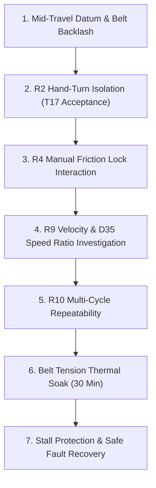

# Mechanical Rig Test Protocol: 44:30 Belt Reduction & Rotary Drive

**Scheduled**: 31 August 2026 (Operator & Mechanical Team Lead)  
**Governing ADRs & Backlog Items**:
- **ADR-0003**: Travel window $\pm 90.0^\circ$ at mechanism output ($264.0^\circ$ / $3004\text{ counts}$ at servo shaft via 44:30 belt reduction; multi-turn disabled; datum mid-travel ~2048).
- **Backlog T17**: Bench rig with belt mounted to provide mechanical leverage for R2's hand-turn scenario.
- **Backlog R2**: Motor isolation (de-energize holding torque, rotate output by hand, live 2 Hz telemetry tracking, seamless torque re-engagement).
- **Backlog R4**: 3D-printed clamping arch with butterfly screws (manual friction lock enabling long-term de-energized holding).
- **Backlog R9 & D35**: Fixed global speed ($30.0^\circ/\text{s}$) validation and investigation of belt ratio factor on `GoalSpeed`.
- **Backlog R10**: Saved-position repeatability across the belt transmission under load.

---

## 1. Physical Architecture & Kinematics (Per Documentation)

The mechanical rig consists of an **ST3215 serial bus servo** coupled to a rotary output shaft via a **44:30 toothed timing belt reduction**:

```
                       [ 44:30 TOOTHED TIMING BELT ]
   [ ST3215 Servo ]                                     [ Rotary Output Shaft ]
     Driving Pulley (44T)  ========================>     Driven Pulley (30T)
     4096 counts/turn                                    Reduction: 44/30 = 1.4667
     Travel: 264.0 deg                                   Reachable Window: +/-90.0 deg
     Counts: 3004 counts                                 Step: 0.0599 deg (~0.06 deg)
     Mid-travel Datum: ~2048 counts                      0.0 deg = center travel
                                                                 |
                                                    [ 3D-Printed Clamping Arch ]
                                                    Manual butterfly friction lock (R4)
```

### Motion & Coordinate Invariants
1. **Ratio**: $\text{Ratio} = \frac{44}{30} \approx 1.4667$.
2. **Output Step Resolution**:
   $$\text{output\_step\_deg} = \left(\frac{360^\circ}{4096}\right) \times \left(\frac{30}{44}\right) \approx 0.05992^\circ \implies 0.06^\circ$$
3. **Travel Window (ADR-0003)**:
   - Output span: $[-90.00^\circ, +90.00^\circ]$ ($180^\circ$ total).
   - Servo shaft span: $[-132.00^\circ, +132.00^\circ]$ ($264.0^\circ$ total, $3004\text{ counts}$).
   - **Datum Law**: The datum **must sit at mid-travel (count ~2048)**. If datum is set near count 0, the negative travel envelope is lost and the servo clamps silently (D1, D9).
4. **Physical Leverage (T17)**: The bare servo shaft has high internal gear resistance that cannot be turned by finger strength alone. The 44:30 belt-driven output pulley and shaft assembly provides the necessary physical leverage for hand manipulation.

---

## 2. Pre-Test Inspection & Mechanical Setup Checklist

- [ ] **Belt Tension & Alignment**: Timing belt seated squarely across 44T and 30T pulleys with proper tension (minimal deflection under 5N finger pressure; no tooth skipping).
- [ ] **Mid-Travel Centering**: With belt disengaged or loose, ensure ST3215 internal potentiometer sits near count 2048 ($\pm 100\text{ counts}$) when the output shaft is visually centered at $0.0^\circ$.
- [ ] **Pulley Set Screws**: Both driving and driven pulley set screws locked onto shaft flats (D-shafts) with threadlocker.
- [ ] **Friction Clamping Arch (R4)**: 3D-printed arch fitted around output shaft; butterfly screws loosened completely to allow free rotation during active tests.
- [ ] **Travel Clearance**: Ensure output shaft can rotate through full $\pm 90^\circ$ without interference from cables or frame.
- [ ] **Electrical Ground & Power**: 12.2V DC power supply attached to servo power harness; USB-C cable attached to Arduino Uno Q for dedicated local session (`adb forward tcp:8001 tcp:8000`).

---

## 3. The 7 Rigorous Test Protocols



---

### Protocol 1: Mid-Travel Datum Calibration & Belt Backlash
**Objective**: Establish physical 0.0° datum at mid-travel and measure belt tooth backlash.

1. **Boot App in Hardware Mode**:
   ```bash
   adb shell arduino-app-cli app restart user:servo_mvp
   ```
2. **Align & Calibrate**:
   - Manually align output shaft to mechanical center mark ($0.0^\circ$).
   - Issue calibration:
     ```bash
     curl -X POST http://127.0.0.1:8001/api/v1/servo/calibrate
     ```
   - **Verification**: `position_verified` becomes `true`. `raw_counts` in response must sit between $1950$ and $2150$ (confirming mid-travel per ADR-0003).
3. **Belt Backlash Measurement**:
   - With motor holding torque active at $0.0^\circ$, gently deflect the output shaft clockwise and counter-clockwise with a finger.
   - Read position jitter via `/servo/state`.
   - **Acceptance Criteria**: Backlash play across belt teeth $\le 0.18^\circ$ ($\le 3\text{ raw counts}$).

---

### Protocol 2: R2 Motor Isolation & Hand-Turn Dynamics (T17 Acceptance)
**Objective**: Formally close Backlog item **T17** and accept requirement **R2** using the belt-driven mechanical leverage.

1. **Engage Isolation**:
   ```bash
   curl -X POST http://127.0.0.1:8001/api/v1/servo/isolate -H "Content-Type: application/json" -d '{"isolated": true}'
   ```
   - **Verification**: Query `/servo/diagnostics/torque_register` — reads `0`. Holding torque is cut.
2. **Manual Hand Rotation**:
   - Grasp the output assembly and rotate the mechanism smoothly by hand through $-45.0^\circ$, $0.0^\circ$, $+45.0^\circ$, $+80.0^\circ$.
   - **Verification**: The web UI position readout and SSE stream update in real time at 2 Hz, accurately displaying the hand-turned angle. `reading_valid` remains `true`.
3. **Seamless Holding Torque Restoration**:
   - While holding output shaft steady at $+45.0^\circ$, release isolation:
     ```bash
     curl -X POST http://127.0.0.1:8001/api/v1/servo/isolate -H "Content-Type: application/json" -d '{"isolated": false}'
     ```
   - **Critical Invariant**: Holding torque re-engages immediately at $+45.0^\circ$. The mechanism does **not** kick back, jump, or move toward $0^\circ$. Target is marked stale.
4. **15-Minute Safety Timeout**:
   - Engage isolation and leave untouched. Verify holding torque automatically re-engages at $900.0\text{s}$ (`isolation_idle_timeout_s`).

---

### Protocol 3: R4 Manual Friction Lock Workflow (Clamping Arch)
**Objective**: Validate the operational sequence of the 3D-printed friction clamp for long-term unpowered field holding.

1. **Move to Target**: Command move to $+30.0^\circ$.
2. **Engage Mechanical Clamp**: Tighten the two butterfly screws onto the 3D-printed arch until the shaft is clamped by friction.
3. **Isolate Motor**: Engage motor isolation (`POST /servo/isolate {isolated: true}`).
   - **Verification**: Motor is de-energized (drawing 0A motor current). The friction clamp holds the output shaft firmly at $+30.0^\circ$ with zero slip.
4. **De-clamp Sequence**:
   - Restore motor torque (`POST /servo/isolate {isolated: false}`). Motor resumes holding.
   - Loosen butterfly screws. Mechanism is free to drive again.
   - Verify position did not shift during clamping/unclamping cycle ($\Delta \le 0.12^\circ$).

---

### Protocol 4: R9 Velocity & D35 Speed Ratio Investigation
**Objective**: Characterize true output angular velocity against commanded $30.0^\circ/\text{s}$ and resolve D35.

1. **Step Move Timing**:
   - Command: $0.0^\circ \to +60.0^\circ$ at default fixed speed ($30.0^\circ/\text{s}$).
   - Time the physical transit using a stopwatch and log timestamps (`servo.move.accepted` to `moving: false`).
2. **Analysis for D35**:
   - If transit takes $\approx 2.0\text{s}$: Output speed is exactly $30.0^\circ/\text{s}$ (the 44:30 reduction is correctly scaled).
   - If transit takes $\approx 1.36\text{s}$: Speed is running at $44.0^\circ/\text{s}$ (suggesting `GoalSpeed` is unscaled by the $1.4667$ belt ratio).
   - Record exact findings in `docs/backlog/D.md` under D35.

---

### Protocol 5: R10 Multi-Point Repeatability Under Belt Drive
**Objective**: Verify that belt transmission does not introduce cumulative step loss or hysteresis across repeated cycles.

1. **Define 3 Operational Saved Positions**:
   - Position A: $-60.00^\circ$
   - Position B: $0.00^\circ$
   - Position C: $+60.00^\circ$
2. **Automated 20-Cycle Round-Trip**:
   - Execute 20 round-trip cycles ($A \to B \to C \to B \to A$) using `/positions/{id}/go`.
3. **Hysteresis & Repeatability Check**:
   - Compare `raw_counts` upon arrival at Position B from the negative direction vs positive direction.
   - **Acceptance Criteria**: Maximum hysteresis delta $\le 2\text{ raw counts}$ ($\le 0.12^\circ$). Zero progressive drift over 20 cycles.

---

### Protocol 6: Belt Tension & Rotational Friction Thermal Soak (30 Min)
**Objective**: Establish motor thermal plateau under continuous belt tension and bearing friction.

1. **Run 30-Minute Continuous Soak**:
   ```bash
   python3 tools/synthetic_operator.py --host 192.168.10.60 --port 8000 --minutes 30 \
       --operators 1 --profile active --report rig_thermal_30m.json
   ```
2. **Thermal & Electrical Evaluation**:
   - Monitor `temperature_c` and `current_a` in telemetry.
   - **Acceptance Gate**: Motor internal temperature must stabilize below **$55.0^\circ\text{C}$** (ambient $+ 30^\circ\text{C}$). Continuous current draw under belt friction must remain $< 0.5\text{A}$.

---

### Protocol 7: Stall Protection & Recovery (ADR-0008)
**Objective**: Verify safety shutdown and recovery if the belt or output shaft encounters an obstruction.

1. **Simulated Mechanical Obstruction**:
   - Place a soft mechanical block at $+45.0^\circ$.
   - Command move to $+70.0^\circ$.
2. **Fault Detection**:
   - Motor encounters resistance at $+45.0^\circ$.
   - ST3215 status register trips Bit 3 (`overload`) or Bit 5 (`overcurrent`).
   - Web UI displays alarm banner and disables further moves.
3. **Recovery**:
   - Clear the obstacle.
   - Call recovery endpoint:
     ```bash
     curl -X POST http://127.0.0.1:8001/api/v1/servo/recover
     ```
   - **Verification**: Overload cleared, holding torque restored, system ready without board reboot.

---

## 4. Post-Test Data Archival & Backlog Sign-Off

1. **Generate Post-Rig Soak Report**:
   ```bash
   python3 tools/soak_report.py --since "<RIG_TEST_START>" --client-report rig_thermal_30m.json
   ```
2. **Documentation Sign-off**:
   - Close **T17** in `docs/backlog/T.md` with physical test evidence.
   - Mark **R2** as accepted in `docs/backlog/R.md`.
   - Update **D35** in `docs/backlog/D.md` with measured velocity findings.
   - Record Rig Day summary in `docs/PROJECT_STATE.md`.
